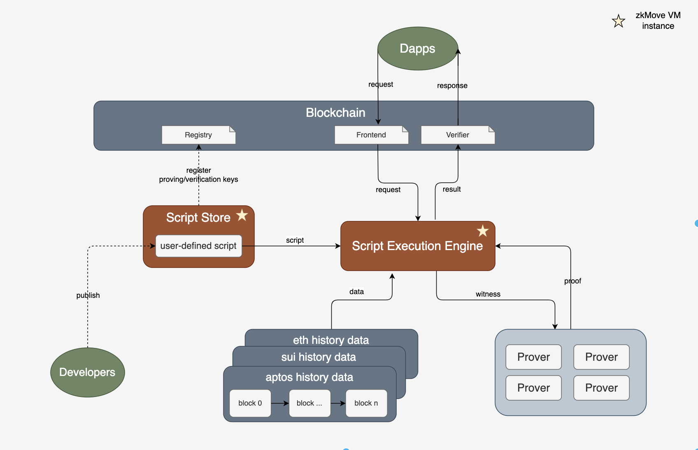

    
    
    

### Overview

**Zero-Knowledge Move Language Virtual Machine**. As a new generation of programming language for smart contract, Move ensures programming safety using its type checking, borrow checking and ownership mechanism. zkMove VM is fully compatible with Move and is the only zkVM with runtime type-safety!

zkMove circuit is built based on the Halo2 proof system. It supports Txn-level concurrent proving for low latency. It also supports client-side proving to naturally preserve user privacy.

**zkMove Trustless Data Service (TDS)**. A blockchain co-processing service built with zkMove, which enables smart contracts to access on-chain historical data in a trust-free manner, and allows arbitrary computations to be performed on the data.

### High-level architecture

### Documents

WIP.

### Source code

[zkMove](https://github.com/young-rocks/zkmove)

[zkMove TDS](https://github.com/young-rocks/agger)

### Demo

[demo](./demo/README.md)

## License

zkMove is licensed as [Apache 2.0](./LICENSE).

